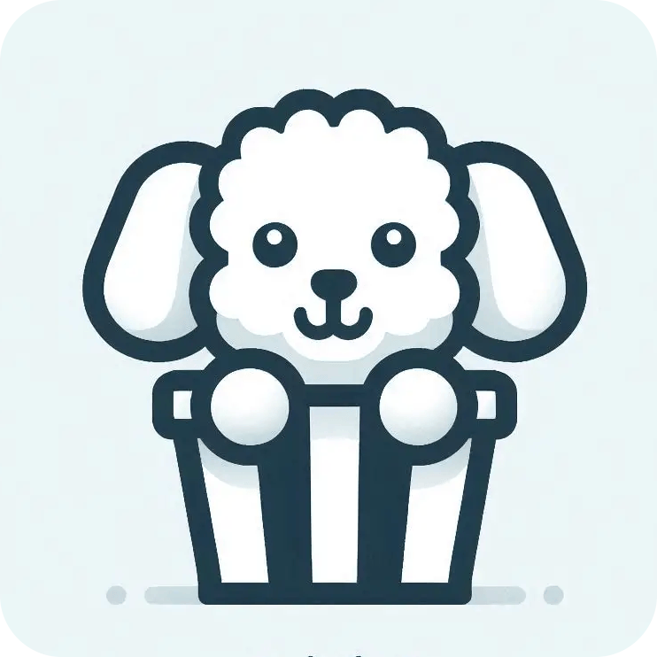

# Collection Tracker

<p align="center">
  
  <br/>
</p>

[](https://nx.dev)
[](https://angular.dev)
[](./LICENSE)

Track and manage your movie and series collection with a modern Angular client and a lightweight Node.js/Express API. This is an Nx workspace containing one client app, one server app, and shared libraries.

## Apps & Libraries

- Client app: `apps/client-app` (Angular standalone)
- Server: `apps/server` (Node/Express via esbuild)
- Libraries:
  - Components — UI elements: libs/components/README.md
  - Services — cross-app services and stores: libs/services/README.md
  - Shared — models, animations, utilities: libs/shared/README.md

## Prerequisites

- Node.js >= 24

## Quick start (Nx)

```powershell
# Install deps
npm install

# Start client and server (dev)
npm start

# Build both apps (includes client pre/post build hooks)
npm run build

# Lint & format
npm run lint
npm run stylelint
npm run format
```

Direct Nx targets
```powershell
# Client
npx nx serve client-app
npx nx build client-app --configuration=production

# Server
npx nx serve server
npx nx build server --configuration=production
```

## Environment

The server reads environment from `/data/.env` (the data folder). If missing in Docker, a minimal default is created automatically.

Minimal example

```dotenv
# /data/.env
JWT_SECRET="your_jwt_secret"
SALT="your_salt"
USER_LIMIT=2
DISABLE_REGISTRATION=0
```

Full example

```dotenv
# /data/.env

# Server
HOST=0.0.0.0
PORT=3000

# CORS
# Use '*' for any origin, or set your SPA origin (e.g., http://localhost:4200)
CORS_ORIGIN=*

# Auth & security
# Required for JWT signing/verification (use a strong, random value)
JWT_SECRET=change-me-to-a-secure-random-string

# Used for hashing (pepper); set a strong, random string
SALT=change-me-to-another-secure-random-string

# Registration controls
# 1 disables new registrations, 0 enables them
DISABLE_REGISTRATION=0

# Limit of registered users
USER_LIMIT=2
```

## Docker

The container serves the built Angular app with Nginx on port 3001 and runs the Node server behind it. Build artifacts must exist in `dist/`.

```powershell
# Build apps
npm run build

# Build image
docker build -t collection-tracker .

# Run (foreground)
docker run --rm -p 3001:3001 -v ${PWD}/.data:/data collection-tracker

# Or detached
docker run --rm -p 3001:3001 -v ${PWD}/.data:/data -d collection-tracker
```

## Release

Create a self-contained release folder with built artifacts and Docker files:

```powershell
# Bump version in package.json as needed, then:
npm run release:create
```

The script builds apps (via `npm run build`) and creates `release/release-<version>/` containing:
- `dist/` — built client and server
- `Dockerfile` and `docker/` — ready to build an image from the release folder

Build an image directly from a release folder:

```powershell
cd release/release-<version>
docker build -t collection-tracker:<version> .
```

## Contributing

Contributions are welcome! Please:

- Use small, focused PRs with clear descriptions.
- Follow workspace conventions: UI in Components, cross-cutting logic in Services/Shared.
- Update relevant README(s) when adding components/services/utils.

Workflow
1) Branch from `main`.
2) Implement changes and run checks/build.
3) Open a PR with screenshots/GIFs when UI changes.

## License

MIT — see [LICENSE](./LICENSE).
